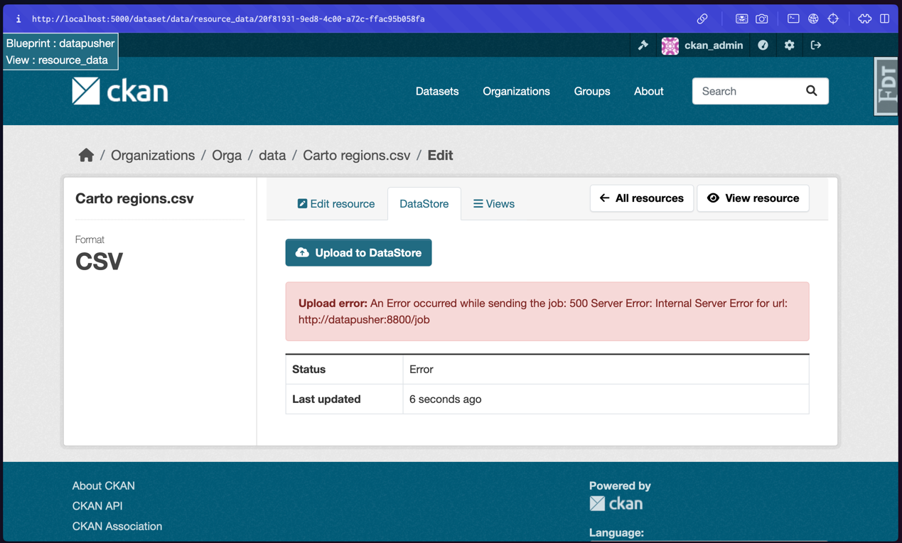
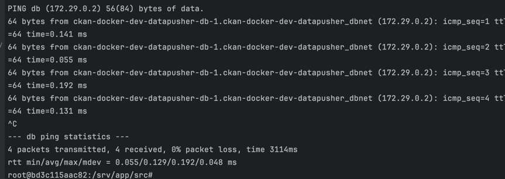
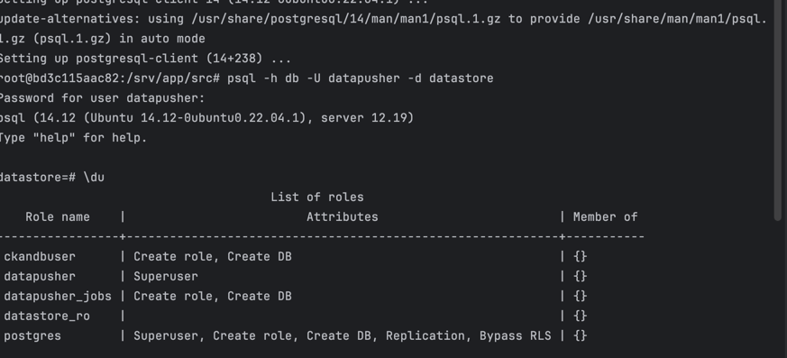
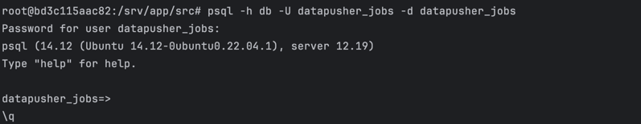

pour résoudre le problème d'accès j'ai ajouté les lignes suivantes dans le fichier docker-compose.dev.yml
    
```yaml
ports:
  - "5432:5432"
```

première erreur : Error: Process completed but unable to post to result_url


pour la résoudre j'ai modifié le fichier datapusher_settings.py en ajoutant la ligne suivante :

```python
SSL_VERIFY = False
```

Nouvelle erreur : 


ping container db depuis container datapusher : 




verfification que l'on peut se connecter a la base de données depuis le container datapusher :


